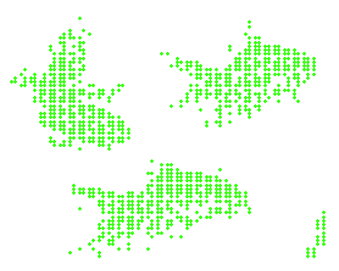

  

# ❀⋅˚₊ ‧ ୨୧ About Me . . .ᐟ

<table width="100%">
<tr>
<td width="70%" valign="middle">

🪼 My name is Anais Polett Rodríguez Carvajal. 
🪼 I am 23 years old. 
🪼 I am from Chile. 
🪼 I'm a fifth-year Civil Engineering student specializing in Computing and Informatics. 

</td>
<td width="30%" align="center" valign="middle">

</td>
</tr>
</table>

<table>
<tr>
<td width="70%" valign="middle">

## Currently

**🪲 Building:**
- Automated medical-certificate verification (authenticity checks + enforcing physician-prescribed rest periods)
- Automated personalized nutrition plans
- A dependency vetting tool for developers (a "dependency firewall" screening packages before they enter the dependency tree)

**🦦 Learning:**
- AWS for cloud security & dependency management
- ERP systems and IT project evaluation

</td>
<td width="30%" align="center" valign="middle">

<em>Animation made by me for a videogame project</em>

</td>
</tr>
</table>

<table>
<tr>
<td width="40%" align="center" valign="middle">

</td>
<td width="70%" valign="middle">

## Interests & Approach

- Software supply-chain security, particularly at the dependency layer
- Systems and framework internals
- Focused on fullstack client work from requirements to cloud deployment
- Automation that reduces friction for the people who depend on it
- Art, creativity, and a long-term interest in no-code frameworks for building fully custom software

</td>
</tr>
</table>

## Main Languages & Tools

<table align="center">
<tr>
<td width="50%" align="center" valign="top">

**Languages & Frameworks** 

</td>
<td width="50%" align="center" valign="top">

**Deploy & Tooling** 

</td>
</tr>
<tr>
<td width="50%" align="center" valign="top">

**Storage & Databases** 

</td>
<td width="50%" align="center" valign="top">

**AI Tools** 

</td>
</tr>
</table>

<table align="center">
  <tr>
    <td align="center" valign="middle">
      
    </td>
    <td align="center" valign="middle">
      <strong>If you want to know more about me, feel free to contact me!</strong>
        
      
      
      
      
    </td>
  </tr>
</table>